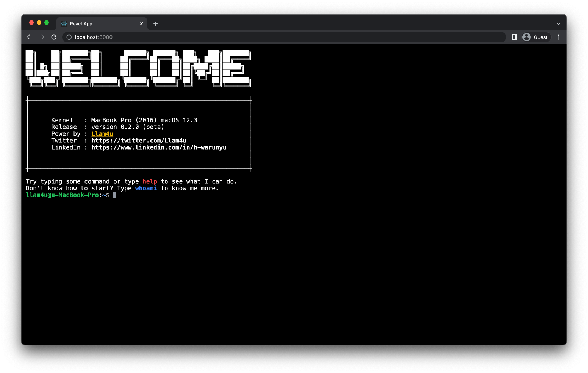

# Llam4u Terminal

Terminal style portfolio responsive website.

> Llam4u | start on 2 Apr 2022

Check out the website [here](https://61130061.github.io/llam4u-terminal/).



I have been using terminal for a while since I started to learn coding.
I decided to build my portfolio website as a terminal website as realistic as I can.
This website was built with pure React JS and Tailwind CSS and of course it is responsive website.
That means it work on mobile phone as well as.
There is no picture on this website.
I am planning to add more command in the future but right there are some for you guys to play with.


## Usage

### Install
Just clone and install it as you used to.
```bash
git clone https://github.com/61130061/llam4u-terminal.git
yarn install
```

### Quick Start
This is my portfolio website.
If you familiar with linux command, you can full around as you want.
If you not quite familiar with this kind of thing, you can follow the structure below to know me more.
1. Type ``whoami`` and press enter! Read my profile.
2. Type ``cd Projects``  and press enter to navigate to projects folder.
3. Type ``open [file name]`` to open each of my project.
4. Hire me.

Isn't it that simple?

### Command
On the website there are several commands that you can play with.
I'm planning to add more in the future.
- help
- whoami
- cat
- open
- ls
- clear
- cd
- theme (toggle dark mode)

### Shortcut
This is all essential shortcuts that you can use to make your life more easier.
- tab
- crtl + L
- crtl + c

## TODO List
- [x] Theme color setting
- [ ] Navigate function through multiple folder (ex. open ~/Projects/DockBar.git)
- [ ] bye command

## Contributing
Feel free to pull requests or open issues as you please.

Help me make it more realistic!
